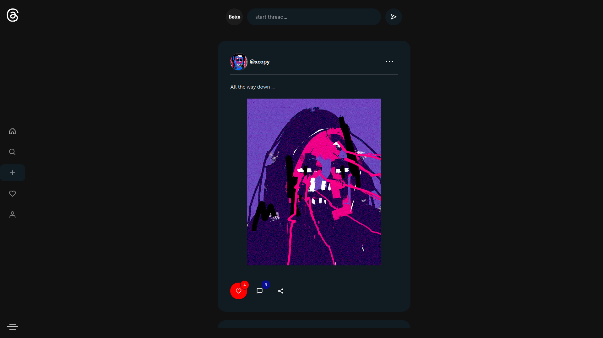
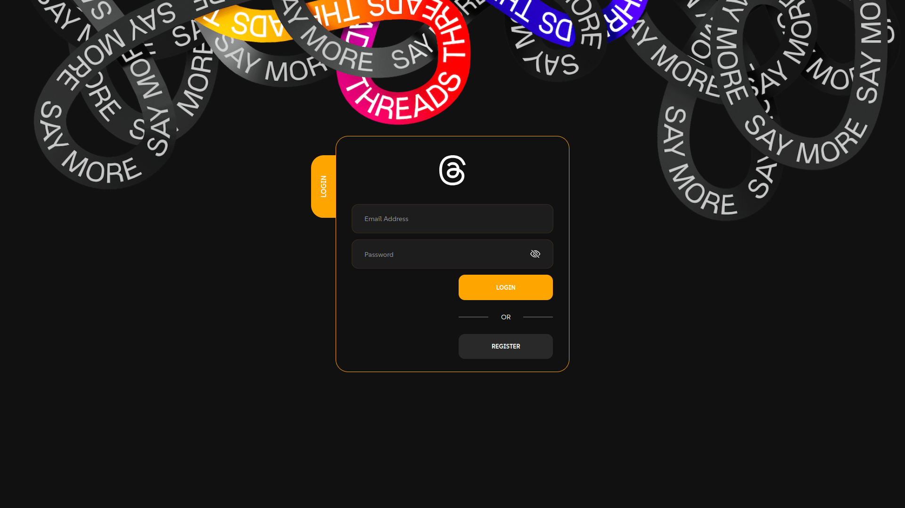
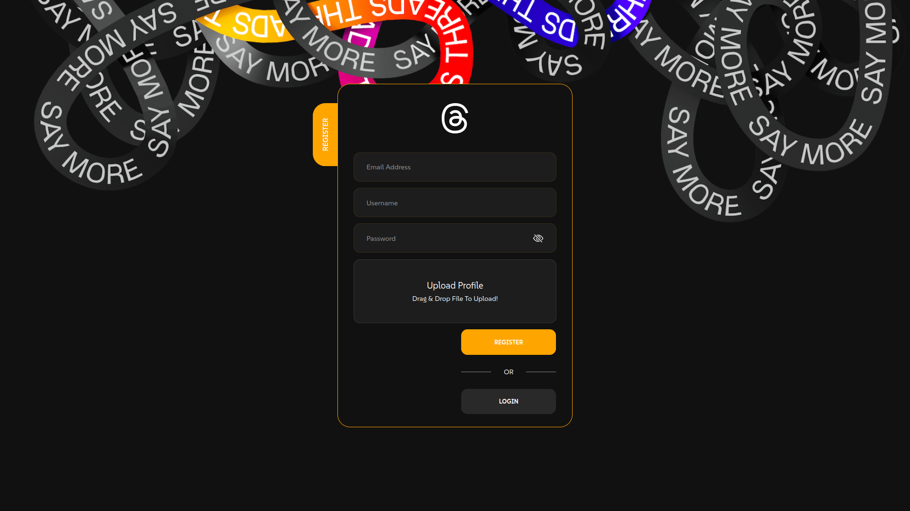
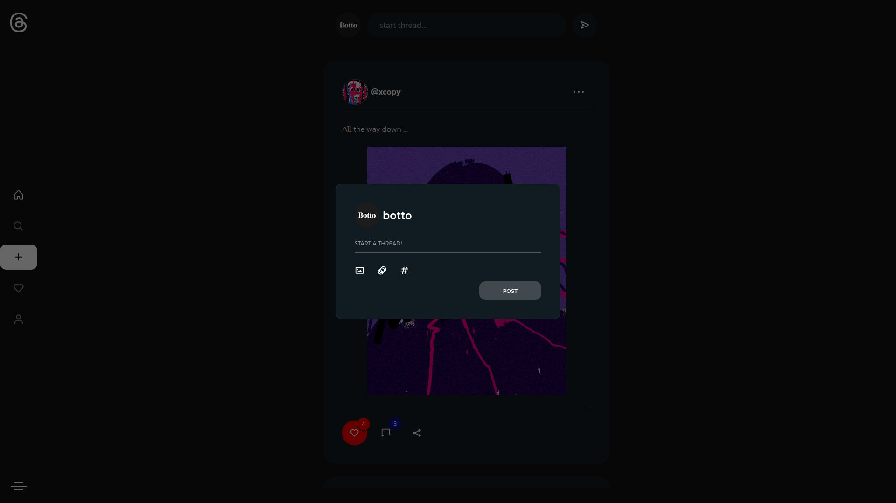
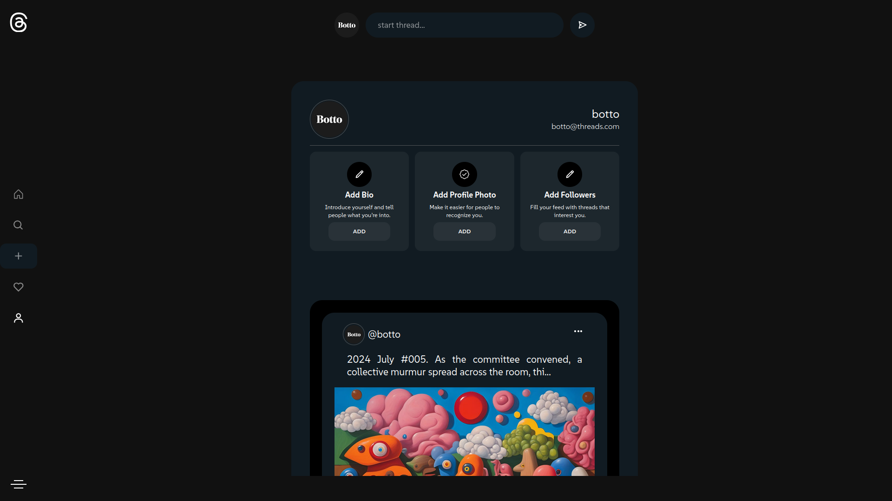

# Threads Clone App

Welcome to the **Threads Clone App**, a social media platform inspired by the popular Threads application. This app allows users to create threads, comment, like, and engage in conversations within a modern, feature-rich interface.

## Features

- User authentication (login/signup)
- Create, edit, and delete threads
- Add and view comments on threads
- Like and unlike threads
- Real-time updates using WebSockets
- Thread and comment author display with avatars
- Responsive and user-friendly UI
- Infinite scroll for threads
- Dark/Light theme toggle
- Web3 wallet integration for decentralized user authentication (Optional)

## Technologies Used

- **Frontend**: React, Redux
- **Backend**: Node.js, Express, MongoDB, Mongoose
- **Authentication**: JWT (JSON Web Tokens)
- **Database**: MongoDB
- **Storage**: Cloudinary for user avatars (Pinata)
- **Web3 Wallet Integration**: MetaMask, Trust Wallet, etc.
- **Other**: Axios, React Hot Toast

## Installation

1. **Clone the repository:**

   ```bash
   git clone https://github.com/username/threads-clone.git
   cd threads-clone
   ```

2. **Install Dependencies:**

   ```bash
    npm install
   ```

3. **You Are Good To Go:**

   ```bash
    npm ren dev
   ```
